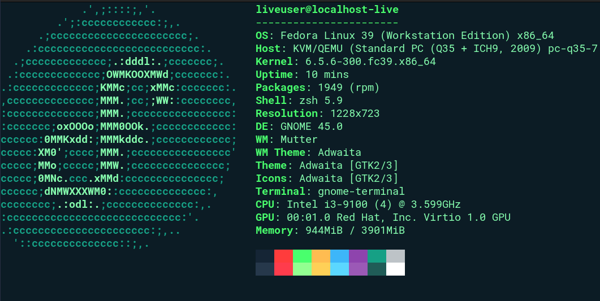

# Pixelgami's Terminal Profile for Fedora (or rpm based distributions Maybe?)



This is my terminal profile for Fedora. Forked from Pixelgami's terminal-profile

# Last Tested date
Tested on Fedora 39 Workstation on a VM

# Prerequisites

For the scripts to work, I think these are the bare minimum requirements.

```bash
# Update your software repositories.
sudo dnf upgrade

# Install Git.
sudo dnf install -y git

# Install Vim.
sudo dnf install -y vim
```

# Installation

```bash
./install_powerline.sh
```

```bash
./install_terminal.sh
```
If the above shows error, you might be in india or china which blocks certain domains. Try again using a vpn

```bash
./install_profile.sh
```
